# ops

A structured development workflow plugin for Claude Code. Plan, implement, debug, review, secure, and ship with discipline.

## Quick use

```
# Main pipeline
/ops:plan add rate limiting to the API     →  /ops:implement  →  /ops:ship
                                                      ↑
                                               /ops:debug (when bugs arise)

# Or all at once
/ops:full add rate limiting to the API     (= plan → implement → ship)

# Specialized pipelines
/ops:do        rename the logger to use structured output
/ops:debug     users get 500 on /api/auth
/ops:test      src/auth/
/ops:refactor  split the god class in OrderService
/ops:perf      /api/search takes 3s, target 500ms
/ops:review-pr 42

# Standalone
/ops:research  how does the payment flow work
/ops:clone-analyze how does express handle middleware error propagation
/ops:brainstorm I need some kind of caching layer
/ops:security
```

## What it does

ops enforces a staged workflow with explicit gates, parallel research, adversarial review, and evidence-based verification. Every claim requires proof. Every major step requires review.

### Workflow

```mermaid
flowchart TD
    %% ─── Pre-work ───
    brainstorm["/ops:brainstorm"] -.->|clarifies intent| plan
    research["/ops:research"] -.->|gathers context| plan

    %% ─── Main pipeline ───
    plan["/ops:plan"] -->|approved plan| implement["/ops:implement"]
    implement -->|code ready| ship["/ops:ship"]

    %% ─── Full chains the main pipeline ───
    full["/ops:full"] ==>|"= plan → implement → ship"| plan

    %% ─── Alternatives ───
    do["/ops:do"] -->|code ready| ship
    debug["/ops:debug"] -->|fix ready| ship
    debug -.->|bugs during| implement

    %% ─── Testing, refactoring, perf ───
    test["/ops:test"] -->|tests added| ship
    test -.->|coverage gate| refactor
    refactor["/ops:refactor"] -->|restructured| ship
    perf["/ops:perf"] -->|optimized| ship

    %% ─── Reviews & audits ───
    review-pr["/ops:review-pr"] -.->|comments on PR| ship
    security["/ops:security"] -.->|audits| ship

    %% ─── Standalone (no workflow edges) ───
    clone-analyze["/ops:clone-analyze"]
    review["/ops:review"]
    verify["/ops:verify"]

    %% ─── Agents ───
    subgraph agents[" Agents "]
        direction LR
        rc{{"researcher-code"}}
        rd{{"researcher-doc"}}
        gh{{"git-historian"}}
        rr{{"researcher-repo"}}
        sr{{"spec-reviewer"}}
        cr{{"critic"}}
        imp{{"implementer ×N"}}
        codrev{{"code-reviewer"}}
        secrev{{"security-reviewer"}}
        tw{{"test-writer"}}
        prrev{{"pr-reviewer"}}
    end

    %% ─── Agent dispatch ───
    research -.-> rc & rd & gh
    research -.->|conditional| rr
    plan -.-> sr & cr
    implement -.-> imp & codrev
    implement -.->|if triggers| secrev
    do -.-> rc & rd & codrev
    do -.->|if triggers| secrev
    debug -.-> gh & codrev
    debug -.->|if triggers| secrev
    test -.-> rc & rd & tw & codrev
    refactor -.-> rc & rd & codrev
    perf -.-> rc & rd & codrev
    review-pr -.-> prrev
    review-pr -.->|if triggers| secrev
    security -.-> secrev
    clone-analyze -.-> rr
```



**Legend:** solid arrow = workflow output, dashed arrow = optional/contextual, thick arrow = chains full pipeline, hexagons = agents, `if triggers` = dispatched conditionally (security-gate), `conditional` = dispatched when confidence is insufficient. Isolated nodes = behavioral/standalone.

### Pipeline skills

| Skill | Role | Input | Output | Agents dispatched |
|---|---|---|---|---|
| `/ops:plan` | Design and plan before coding | Clarified need | Spec + plan decomposed into tasks + user approval | via research, spec-reviewer, critic |
| `/ops:implement` | Execute the plan task by task | Validated plan | Implemented, reviewed, and validated code | implementer (xN), code-reviewer, security-reviewer (if triggers) |
| `/ops:ship` | Commit, PR, capture learnings | Completed code | Commit, PR (optional), learnings, rule proposals | None |
| `/ops:do` | Lightweight pipeline: research, execute, verify, review | Well-understood task | Implemented and reviewed code | researcher-code, researcher-doc, code-reviewer, security-reviewer (if triggers) |
| `/ops:debug` | Systematic investigation: hypothesize, test, fix, verify | Bug, error, or unexpected behavior | Diagnosed and fixed code | git-historian, code-reviewer, security-reviewer (if applicable) |
| `/ops:full` | All-in-one meta-pipeline | Work description | Everything (plan + implement + ship chained) | All from plan + implement + ship |
| `/ops:test` | Add tests to existing untested code | Files/modules to test | Tests written, coverage improved | researcher-code, researcher-doc, test-writer, code-reviewer |
| `/ops:refactor` | Restructure code without changing behavior | Code to refactor + goal | Refactored code, tests still passing | researcher-code, researcher-doc, code-reviewer |
| `/ops:perf` | Performance investigation and optimization | What's slow + target | Optimized code with measured before/after | researcher-code, researcher-doc, code-reviewer |
| `/ops:review-pr` | Review an external pull request | PR number/URL | Structured review with actionable comments | pr-reviewer, security-reviewer (if triggers) |

### Standalone skills

| Skill | Role | When to use |
|---|---|---|
| `/ops:research` | Explore codebase and documentation (3 agents + conditional repo clone) | Understand a codebase area, gather docs, investigate history |
| `/ops:clone-analyze` | Clone and analyze an external repo to understand its internals | Understand a library, framework, or tool by reading its source code |
| `/ops:brainstorm` | Clarify needs via Socratic dialogue | Explore intent and requirements before planning |
| `/ops:review` | Technically evaluate code review feedback | Receiving comments on code (human or CI) |
| `/ops:security` | On-demand security audit | Security review of changes or specific files |
| `/ops:verify` | Behavioral rule: evidence before any claim | Always active — applies in all contexts |

### Internal phases (`user-invocable: false`)

Shared logic extracted from skills. Not callable by the user — invoked programmatically by parent skills.

| Phase | Role | Used by |
|---|---|---|
| `ops:instruction-priority` | Instruction hierarchy (user > CLAUDE.md > ops skill > system prompt) | all skills |
| `ops:subagent-rules` | Context rules for dispatching subagents (inline content, scoping, labeling) | plan, implement, do, debug, research, clone-analyze, test, refactor, perf, review-pr |
| `ops:environment-setup` | Detect languages/frameworks + 4-level LSP diagnostic | plan |
| `ops:code-quality` | Format + lint modified files before code review | implement, do, test, refactor, perf |
| `ops:discovery-checks` | Categorize unexpected discoveries (Minor / Significant / Major) | implement, debug |
| `ops:circuit-breaker` | Diagnose repeated failures (researcher-code + git-historian) | implement (3+ failures), debug (5+ failures) |
| `ops:security-gate` | Triage (14 triggers) + dispatch security-reviewer + re-verification loop (cap 3) | implement, do, security, review-pr |
| `ops:redispatch-optimization` | Generic re-dispatch prompt optimization for review agents | plan (spec-reviewer, critic), implement (code-reviewer), security (security-reviewer) |

### Agents

| Agent | Role | Dispatched by | Usage |
|---|---|---|---|
| **researcher-code** | Explore codebase: patterns, conventions, implementations, integration points, risks | research, do, test, refactor, perf, implement (circuit-breaker), debug (circuit-breaker) | Read-only source code analysis |
| **researcher-doc** | Search official docs for libs/tools/APIs (Context7 MCP, fallback WebSearch) | research, do, test, refactor, perf | Doc queries, API schemas, config references |
| **git-historian** | Mine git history: timelines, regressions, ownership, hotspots, architectural decisions | research, implement (circuit-breaker), debug (circuit-breaker) | 2 modes: Research (broad exploration) and Investigation (targeted at failing files) |
| **researcher-repo** | Clone and analyze external repositories: version-aware analysis, structured findings | research (conditional), clone-analyze | Shallow clone, code analysis, version comparison |
| **spec-reviewer** | Review spec for completeness, consistency, clarity, and feasibility | plan | Verdict: Approved / Issues Found. Mandatory re-dispatch if issues (max 3 iterations) |
| **critic** | Adversarial plan review: completeness, coherence, security, CLAUDE.md compliance | plan | Verdict: APPROVE / REJECT with confidence levels. Pre-engagement prediction to avoid confirmation bias |
| **implementer** | Execute one plan task (TDD, code generation, validation) | implement | 1 agent per plan task. Pipeline: implement, validation gate, conformity check |
| **code-reviewer** | Code review: spec compliance, quality, TDD adherence, anti-patterns | implement (final review), do, test, refactor, perf | Review on complete diff after all tasks. Verdict: Approved / Issues (Important/Suggestions) / Critical |
| **security-reviewer** | Deep security analysis: code, infra, CI/CD, containers, supply chain | via security-gate: implement, do, security, review-pr | Dispatched only if security-gate detects sensitive domains. Re-dispatch loop (max 3) after fixes |
| **test-writer** | Analyze existing code and write tests: behavior analysis, edge cases, coverage | test, refactor (pre-refactor coverage) | Writes tests only, does not modify production code |
| **pr-reviewer** | Review external PRs: quality, security, conventions, actionable comments | review-pr | Structured review with severity levels (Critical / Important / Nits) |

## Install

### From marketplace (recommended)

Add the marketplace, then install the plugin:

```
/plugin marketplace add gigi206/ops
/plugin install ops
```

### From a local clone

If you have a local clone of the repository:

```
/plugin install /path/to/ops
```

### Verify

After install, restart Claude Code and type `/ops:plan`. If the skill loads, you're set.

## Requirements

- **Claude Code** — required
- **Node.js** — only needed for the visual brainstorm companion (optional)
- **Git** — needed by the git-historian agent (optional, skipped if unavailable)
- **Context7 MCP** — needed by researcher-doc (optional, falls back to web search)

No npm dependencies. No database. No compiled binaries.

## Usage

### Quick start

```
/ops:plan add rate limiting to the API endpoints
```

After the plan is approved:

```
/ops:implement
```

When done:

```
/ops:ship
```

### Tips

- **Unknown library or tool?** — Use `/ops:clone-analyze` to read the source code of an external library, framework, or tool. ops can also trigger this automatically during `/ops:research` when documentation is insufficient — it clones the source into a temporary directory, analyzes it, and cleans up.

## Skills Reference

### `/ops:plan`

Brainstorm, research, and plan before writing code.

```
/ops:plan <description of what you want to do>
```

| Step               | What happens                                                         |
|--------------------|----------------------------------------------------------------------|
| Brainstorm         | Socratic-style design discussion — one question at a time            |
| Context detection  | Detect languages, check LSP availability, read project conventions   |
| Parallel research  | Delegates to `/ops:research` (3 agents in parallel)                  |
| Research adequacy  | Evidence table presented to user — gaps trigger follow-up research   |
| Design approaches  | 2-3 options with pros/cons, recommendation first                     |
| Spec writing       | Design document written, reviewed by spec-reviewer, approved by user |
| Task decomposition | Ordered tasks with files, changes, and validation commands           |
| Critic review      | Adversarial review (4 lenses, 3 perspectives, self-audit)            |
| User approval      | Plan presented for final approval before implementation              |

Agents used: via **`/ops:research`** (researcher-code, researcher-doc, git-historian, **researcher-repo** conditional), **spec-reviewer**, **critic**

---

### `/ops:full`

Full pipeline: plan, implement, and ship in a single session.

```
/ops:full <description of what you want to do>
```

Chains `/ops:plan` → user approval → `/ops:implement` → `/ops:ship`. Each sub-skill runs in full with all gates preserved.

---

### `/ops:do`

Lightweight structured workflow for well-understood tasks.

```
/ops:do <description of what you want to do>
```

| Step                         | What happens                                                         |
|------------------------------|----------------------------------------------------------------------|
| Restatement                  | Quick reformulation of intent — no brainstorming                     |
| Research                     | 2 agents in parallel: researcher-code, researcher-doc                |
| Scope guard                  | If too complex, suggest escalating to `/ops:plan`                    |
| Tasks (optional)             | Light task breakdown based on decision complexity                    |
| Execute                      | Implement changes directly                                           |
| Verify + Code quality        | Build/compile check + format/lint (`ops:code-quality`)               |
| Security gate + Code review  | Security triage + light code review (1 cycle max)                    |
| Tests + Docs + CLAUDE.md     | Run tests, update docs, verify project rules                        |

Agents used: **researcher-code**, **researcher-doc**, **code-reviewer**, **security-reviewer** (if triggers)

---

### `/ops:implement`

Execute a validated plan task by task.

```
/ops:implement
```

Prerequisite: a plan from `/ops:plan` or user-provided.

Each task goes through the full pipeline:

| Step             | What happens                                                           |
|------------------|------------------------------------------------------------------------|
| Implementer      | One agent per task, TDD enforced when tests are relevant               |
| Validation gate  | Run validation commands, show output — no "it should work"             |
| Conformity check | Diff vs. plan — no drift, no secrets, conventions preserved            |
| Discovery check  | Pause on significant findings, stop on major discoveries               |

After all tasks: code quality (`ops:code-quality`) → security triage → final review (code-reviewer + security-reviewer if applicable).

**Security escalation triggers** — the security-reviewer is dispatched when the task touches:

- Authentication, authorization, or identity federation
- APIs or interfaces exposed beyond the trust boundary
- Secrets, credentials, keys, or tokens
- Encryption or certificate configuration
- User input handling or data validation
- Access control rules or permission models
- Network exposure, firewall rules, or traffic policies
- Infrastructure definitions (IaC)
- CI/CD pipeline configuration
- Container, VM, or runtime privileges
- Dependencies or supply chain changes
- Policy enforcement or compliance rules
- Data storage, retention, or backup configuration
- Logging, audit, or observability configuration

**Circuit breaker**: 3+ consecutive failures triggers diagnostic agents (researcher-code + git-historian) and presents options to the user.

Agents used: **implementer**, **code-reviewer**, **security-reviewer** (when applicable)

---

### `/ops:debug`

Systematic debugging: investigate, hypothesize, fix.

```
/ops:debug <description of the problem>
```

| Step            | What happens                                                              |
|-----------------|---------------------------------------------------------------------------|
| Investigate     | Read errors, reproduce, dispatch git-historian for recent changes         |
| Instrument      | Add temporary logging at component boundaries (multi-component bugs only) |
| Hypothesize     | Max 3 hypotheses with supporting evidence and disproof criteria           |
| Test            | Confirm or refute each hypothesis with minimal tests                      |
| Fix             | Minimal fix addressing root cause, not symptoms                           |
| Code review     | Same pipeline as `/ops:implement` including security escalation           |
| Discovery check | Pause if the bug is broader than diagnosed                                |
| Verify          | Original failing command passes, no regressions — show proof              |

**Circuit breaker**: 5+ failed fix attempts triggers diagnostic agents and presents options.

Agents used: **git-historian**, **code-reviewer**, **security-reviewer** (when applicable), **researcher-code** (circuit breaker)

---

### `/ops:test`

Add tests to existing untested code.

```
/ops:test <files or modules to test>
```

| Step | What happens |
|------|-------------|
| Scope | Identify what to test, measure current coverage if possible |
| Research | 2 agents in parallel: researcher-code (code analysis), researcher-doc (test framework docs) |
| Test-writer | Dispatch test-writer agent: analyze behavior, identify edge cases, write tests |
| Validate | Run full test suite — new + existing tests must pass |
| Code quality | Format + lint (`ops:code-quality`) |
| Code review | Light review focused on test quality (1 cycle max) |

Agents used: **researcher-code**, **researcher-doc**, **test-writer**, **code-reviewer**

---

### `/ops:refactor`

Restructure code without changing behavior.

```
/ops:refactor <what to refactor and why>
```

| Step | What happens |
|------|-------------|
| Scope | Clarify target and goal — what's wrong, what "better" looks like |
| Research | 2 agents in parallel: researcher-code (map dependencies, risks), researcher-doc (refactoring patterns) |
| Coverage gate | **Hard gate** — verify tests exist before touching code. Low coverage → suggest `/ops:test` first |
| Plan steps | Break into small, independently verifiable transformations |
| Execute | One step at a time, run tests after each step |
| Verify | Full test suite passes, behavior unchanged |
| Code quality | Format + lint (`ops:code-quality`) |
| Code review | Review focused on behavior preservation (1 cycle max) |

Agents used: **researcher-code**, **researcher-doc**, **code-reviewer**

---

### `/ops:perf`

Performance investigation and optimization.

```
/ops:perf <what's slow and target performance>
```

| Step | What happens |
|------|-------------|
| Define | What's slow, how slow, what's the target |
| Baseline | Measure current performance (3+ runs, median). **No baseline = no optimization** |
| Research | 2 agents in parallel: researcher-code (profile hot paths), researcher-doc (optimization patterns) |
| Hypothesize | Identify bottleneck with evidence, propose optimization |
| Optimize | One change at a time, preserve correctness |
| Measure | Re-measure with same method — show before/after delta. No improvement → revert |
| Verify | Full test suite passes, behavior unchanged |
| Code quality | Format + lint (`ops:code-quality`) |
| Code review | Review focused on correctness preservation and optimization soundness (1 cycle max) |

Agents used: **researcher-code**, **researcher-doc**, **code-reviewer**

---

### `/ops:review-pr`

Review an external pull request.

```
/ops:review-pr <PR number or URL>
```

| Step | What happens |
|------|-------------|
| Load PR | Fetch diff, description, related issues via `gh` |
| Context | Read CLAUDE.md conventions, scan affected area |
| PR reviewer | Dispatch pr-reviewer agent: quality, conventions, logic, tests |
| Security gate | Triage diff against security triggers, dispatch security-reviewer if needed |
| Present | Structured review (Critical / Important / Nits). Offer to post on PR |

Agents used: **pr-reviewer**, **security-reviewer** (if triggers)

---

### `/ops:research`

Autonomous codebase and documentation exploration.

```
/ops:research <topic or question>
```

Dispatches 3 agents in parallel (researcher-code, researcher-doc, git-historian), synthesizes findings, and conditionally dispatches researcher-repo when confidence is insufficient. Read-only — no changes made.

---

### `/ops:clone-analyze`

Clone and analyze an external repository.

```
/ops:clone-analyze <library, framework, or tool to analyze>
```

Clones the repository (version-matched when possible), analyzes it, and presents structured findings. Use when documentation is insufficient or you need to understand internals.

Agents used: **researcher-repo**

---

### `/ops:brainstorm`

Interactive brainstorming to clarify needs before planning.

```
/ops:brainstorm <what you want to explore>
```

Socratic-style dialogue: clarity check, context exploration, scope assessment, YAGNI filter. Discussion-only — no agents dispatched, no changes made.

---

### `/ops:security`

On-demand security review of code, infrastructure, or pipeline changes.

```
/ops:security                     # staged + unstaged changes
/ops:security path/to/file        # specific file or directory
/ops:security --branch            # current branch vs. base branch
/ops:security --commit <ref>      # specific commit
```

| Step           | What happens                                                   |
|----------------|----------------------------------------------------------------|
| Scope          | Determine what to review based on arguments                    |
| Triage         | Identify which security domains are touched                    |
| Review         | Dispatch security-reviewer with scoped diff and context        |
| Report         | Present findings with attack scenarios and fix recommendations |
| Fix (optional) | Apply fixes if requested, re-verify with security-reviewer     |

If no security-sensitive areas are found, reports that and offers to run anyway.

Agents used: **security-reviewer**

---

### `/ops:review`

Evaluate code review feedback technically before acting.

```
/ops:review
```

Use when you receive feedback from a human reviewer, CI check, or code-reviewer agent.

| Feedback type                      | Response                                                      |
|------------------------------------|---------------------------------------------------------------|
| Factual ("bug on line 42")         | Reproduce, confirm or refute with evidence                    |
| Style ("use X pattern")            | Check project conventions first, then evaluate on merit       |
| Architectural ("restructure this") | Evaluate against spec, discuss before changing                |
| Security ("vulnerable to X")       | Always take seriously, verify attack vector, fix if confirmed |

Rules: no performative agreement, no silent ignoring, no unverified changes. Push back with evidence when feedback is incorrect.

---

### `/ops:ship`

Commit, PR, and capture learnings.

```
/ops:ship
```

| Step           | What happens                                                          |
|----------------|-----------------------------------------------------------------------|
| Verify         | Run all validation commands, linters, tests                           |
| Summarize      | Files modified/created, what was done, deviations from plan           |
| Commit         | Stage specific files, propose message, wait for approval              |
| PR (optional)  | Push and create PR if requested                                       |
| Learnings      | Problems solved, decisions made, gotchas, patterns that worked        |
| Rule proposals | Recurring learnings proposed as `.claude/rules/` (with user approval) |

Rules: never commit secrets, never push without approval, never skip validation.

---

### `/ops:verify`

Evidence before claims. Always active — not a workflow, a behavioral rule.

This skill is **always on** across all other skills and outside of ops. It enforces one rule: **never claim a result without showing the evidence.**

| Claim              | Required evidence                       |
|--------------------|-----------------------------------------|
| "Tests pass"       | Test command output showing 0 failures  |
| "Build succeeds"   | Build command output with exit code 0   |
| "No lint errors"   | Linter output showing 0 warnings/errors |
| "Fix works"        | Original failing command now succeeds   |
| "Deploy succeeded" | Status command showing healthy state    |

Red flags: "should", "probably", "seems to", "I believe" — if these appear instead of command output, the claim is unverified.

## Design Principles

- **Evidence before claims** — `verify` is always active. No "it should work".
- **Parallel research** — 3 agents run simultaneously during planning, with conditional repository cloning when confidence is insufficient.
- **Adversarial review** — the critic agent tries to break your plan before you build it.
- **Circuit breakers** — repeated failures escalate to diagnostics, not infinite retries.
- **Instruction priority** — user > CLAUDE.md > ops > system defaults. Conflicts resolved explicitly.
- **TDD enforced** — the implementer follows Red-Green-Refactor with anti-rationalization gates and a deletion rule for code written before tests.
- **Minimal hooks** — one SessionStart hook injects skill awareness. No keyword detection, no prompt interception, no hidden automation.
- **Composable phases** — shared content extracted into reusable internal phases. Skills reference phases instead of duplicating content.
- **Lightweight** — pure documentation + a small brainstorm server. No npm deps, no database, no compiled code.

## Structure

```
ops/
├── .claude-plugin/
│   ├── marketplace.json               # Marketplace registry entry
│   └── plugin.json                    # Plugin manifest
├── agents/                            # 11 specialized agents
│   ├── code-reviewer.md
│   ├── critic.md
│   ├── git-historian.md
│   ├── implementer.md
│   ├── pr-reviewer.md
│   ├── researcher-code.md
│   ├── researcher-doc.md
│   ├── researcher-repo.md
│   ├── security-reviewer.md
│   ├── spec-reviewer.md
│   └── test-writer.md
├── hooks/
│   ├── hooks.json                     # SessionStart hook config
│   └── session-start                  # Injects skill routing context
├── skills/
│   │
│   │── # ─── PIPELINES (user-facing) ───
│   ├── plan/SKILL.md                  # Brainstorm → research → design → spec → plan → critic
│   ├── implement/SKILL.md             # Load plan → execute tasks → review
│   ├── do/SKILL.md                    # Lightweight: research → execute → verify → review
│   ├── debug/SKILL.md                 # Investigate → hypothesize → fix → verify
│   ├── ship/SKILL.md                  # Verify → commit → PR → learnings
│   ├── full/SKILL.md                  # Meta: plan → implement → ship
│   ├── test/SKILL.md                  # Analyze code → write tests → validate
│   ├── refactor/SKILL.md             # Coverage gate → incremental changes → verify
│   ├── perf/SKILL.md                 # Baseline → profile → optimize → measure
│   ├── review-pr/SKILL.md            # Load PR → analyze → review → security gate
│   │
│   │── # ─── STANDALONE (user-facing) ───
│   ├── research/SKILL.md              # 3 agents in parallel (codebase, docs, git) + conditional repo clone
│   ├── brainstorm/SKILL.md            # Socratic brainstorming
│   ├── clone-analyze/SKILL.md         # Clone and analyze external repos
│   ├── review/SKILL.md                # Evaluate feedback technically
│   ├── security/SKILL.md              # On-demand security review
│   ├── verify/SKILL.md                # Evidence before claims (behavioral)
│   │
│   │── # ─── INTERNAL PHASES (user-invocable: false) ───
│   ├── instruction-priority/SKILL.md  # Instruction hierarchy when conflicts arise
│   ├── subagent-rules/SKILL.md        # Agent dispatch rules
│   ├── environment-setup/SKILL.md     # Language detection + LSP diagnostic
│   ├── code-quality/SKILL.md          # Format + lint before review
│   ├── discovery-checks/SKILL.md      # Minor/Significant/Major
│   ├── circuit-breaker/SKILL.md       # Repeated failure diagnostic
│   ├── security-gate/SKILL.md         # Triage + dispatch + re-verification loop
│   ├── redispatch-optimization/SKILL.md # Re-dispatch prompt optimization
│   │
│   │── # ─── ANNEXES ───
│   ├── implement/tdd-reference.md
│   ├── implement/testing-anti-patterns.md
│   └── plan/visual-companion.md
│
├── CHANGELOG.md
├── COMPARISON-vs-SUPERPOWERS.md
└── LICENSE
```

## License

MIT — Ghislain LE MEUR. Incorporates code from [superpowers](https://github.com/obra/superpowers) (Jesse Vincent, MIT).
