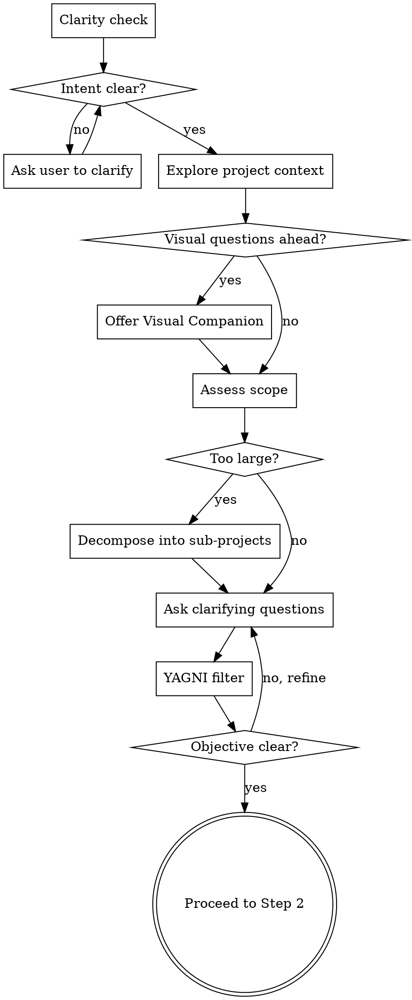

# /ops:plan — Brainstorm, research, and plan

<HARD-GATE>
STOP. Before doing ANYTHING else — before researching, before spawning agents, before writing a plan — you MUST talk to the user first.

Your FIRST message must be a clarity check or a clarifying question. NOT a research result. NOT a plan. NOT an agent dispatch.

If your first action is spawning a research agent, you have FAILED this skill. Go back and ask the user a question first.

The steps are: 1. Brainstorm WITH the user → 2. Context → 3. Research → ... You cannot skip step 1.
</HARD-GATE>

## When to use which skill

| Situation | Skill | Why |
|-----------|-------|-----|
| New feature, change, or task | `/ops:plan` | Design before coding |
| Plan approved, ready to build | `/ops:implement` | Execute with validation gates |
| Bug, error, or unexpected behavior | `/ops:debug` | Investigate before fixing |
| Work is done, ready to commit | `/ops:ship` | Commit, PR, capture learnings |
| Claiming something works | `/ops:verify` | Evidence before claims (always active) |
| Received code review feedback | `/ops:review` | Evaluate technically, don't agree blindly |
| Quick fix you already understand | No skill needed | Just do it |

## Overview

This skill runs before any implementation. It brainstorms the design with the user, gathers intelligence via parallel research agents, writes a detailed plan decomposed into tasks, and validates it through an adversarial critic.

## Instruction Priority

When instructions conflict, follow this order:

1. **User's explicit instructions** — highest priority. If the user says "skip TDD", skip it.
2. **CLAUDE.md project rules** — project-specific overrides.
3. **ops skill instructions** — this document.
4. **Default system prompt** — lowest priority.

If a CLAUDE.md rule contradicts an ops skill instruction, follow CLAUDE.md. If the user contradicts CLAUDE.md, follow the user. When in doubt, ask.

## Subagent Context Rules

When dispatching any subagent (researcher-code, researcher-doc, git-historian, spec-reviewer, critic):

- **Provide content inline.** If you already read a file, paste the relevant content into the agent prompt. Do NOT ask the agent to re-read the same file.
- **Scope the context.** Give the agent only what it needs for its task — not the entire plan, not every file you've read. A researcher-code analyzing conventions needs the task area files, not the brainstorm transcript.
- **Name what you provide.** Always label pasted content with its source: `[From deploy/argocd/apps/cilium/applicationset.yaml]`. The agent needs to know where the content comes from to cite it.
- **Let the agent explore beyond.** Providing context doesn't mean restricting the agent. It can and should read additional files it discovers during exploration — the goal is to avoid redundant reads, not to limit scope.

## Workflow

```
1. Brainstorm → 2. Context Detection → 3. Parallel Research → 4. Research Adequacy Check → 5. Design Approaches → 6. Write & Review Spec → 7. Write Plan → 8. Critic Review → 9. User Approval
```

---

## Step 1: Brainstorm (MANDATORY — cannot be skipped)

### Anti-Pattern: "This Is Too Simple To Need A Design"

Every project goes through this process. A config change, a single-function utility, a bug fix — all of them. "Simple" projects are where unexamined assumptions cause the most wasted work. The design can be short (a few sentences for truly simple projects), but you MUST present it and get approval.

### Checklist

You MUST complete these steps in order:

- [ ] 1. **Clarity check** — verify you understand the intent before exploring
- [ ] 2. **Explore project context** — check files, docs, recent commits
- [ ] 3. **Offer visual companion** — if topic will involve visual questions (see Visual Companion section below)
- [ ] 4. **Assess scope** — decompose if too large for a single spec
- [ ] 5. **Ask clarifying questions** — one at a time, Socratic style
- [ ] 6. **Challenge scope with YAGNI** — remove unnecessary complexity
- [ ] 7. **Gate** — objective clear, scope agreed

### Process Flow



### The Process

**Clarity check (before anything else):**
Before exploring code or asking detailed questions, verify you understand the user's intent. Ask yourself:
1. **What** is being asked? (Can you restate it in one sentence?)
2. **Why** does the user want this? (What problem does it solve?)
3. **What does success look like?** (How will the user know it works?)

If you can't answer all 3 confidently from the user's request, ask the user to clarify **before** exploring the project. One short question, not three.

> Example: "Before I dive in — I want to make sure I understand. You want [restatement]. The goal is [why]. Is that right, or am I missing something?"

This prevents building the wrong thing. A 10-second check saves hours of wasted planning.

**Exploring the project:**
- Check out the current project state first (files, docs, recent commits)
- Understand existing structure and conventions before asking questions
- This informs your questions — ask smart questions, not generic ones

**Offering the visual companion:**
- If upcoming questions will involve visual content (mockups, layouts, diagrams, architecture), offer the visual companion once for consent. See the Visual Companion section below.
- **This offer MUST be its own message.** Do not combine with clarifying questions.
- If the user declines, proceed with text-only brainstorming.

**Assessing scope:**
- If the request describes multiple independent subsystems, flag this immediately
- Do NOT spend questions refining details of a project that needs to be decomposed first
- Help the user decompose into sub-projects: what are the independent pieces, how do they relate, what order should they be built?
- Each sub-project gets its own spec → plan → implementation cycle

**Asking clarifying questions:**
- **One question at a time** — do NOT overwhelm with multiple questions
- **Multiple choice preferred** — easier to answer than open-ended when possible
- Focus on understanding: purpose, constraints, success criteria
- If a topic needs more exploration, break it into multiple questions

**Challenging scope with YAGNI:**
- Is every part of the request actually needed right now?
- Can a simpler version achieve the same goal?
- Are there features that "might be useful later" but aren't required? Remove them.
- Say explicitly what you're excluding and why. Let the user push back if they disagree.

**Working in existing codebases:**
- Explore the current structure before proposing changes. Follow existing patterns.
- Where existing code has problems that affect the work (e.g., a file that's grown too large, unclear boundaries), include targeted improvements as part of the design.
- Do NOT propose unrelated refactoring. Stay focused on what serves the current goal.

### Gate

**Do NOT proceed to context detection until the objective is clear and the scope is agreed.**

### Visual Companion

A browser-based companion for showing mockups, diagrams, and visual options during brainstorming. Available as a tool — not a mode. Accepting the companion means it's available for questions that benefit from visual treatment; it does NOT mean every question goes through the browser.

**Offering the companion:** When you anticipate that upcoming questions will involve visual content (mockups, layouts, diagrams), offer it once for consent:
> "Some of what we're working on might be easier to explain if I can show it to you in a web browser. I can put together mockups, diagrams, comparisons, and other visuals as we go. This feature is still new and can be token-intensive. Want to try it? (Requires opening a local URL)"

**Per-question decision:** Even after the user accepts, decide FOR EACH QUESTION whether to use the browser or the terminal. The test: **would the user understand this better by seeing it than reading it?**

- **Use the browser** for content that IS visual — mockups, wireframes, layout comparisons, architecture diagrams, side-by-side visual designs
- **Use the terminal** for content that is text — requirements questions, conceptual choices, tradeoff lists, scope decisions

If they agree to the companion, read the detailed guide before proceeding:
`skills/plan/visual-companion.md`

---

## Step 2: Context Detection

### 2a. Detect languages

Scan the codebase to identify the primary languages and frameworks:
- Use Glob to check for file extensions (e.g., `**/*.py`, `**/*.ts`, `**/*.go`, `**/*.rs`, `**/*.java`, `**/*.rb`, `**/*.yaml`, `**/*.sh`)
- Read config files that indicate the stack (`package.json`, `Cargo.toml`, `go.mod`, `requirements.txt`, `Gemfile`, `Makefile`, etc.)

### 2b. Check LSP availability

LSP (Language Server Protocol) gives the agent real diagnostics (type errors, missing imports, syntax issues) instead of guessing. It makes every agent in the pipeline smarter.

For each language detected in Step 2a, check if LSP is usable by working through 4 levels. Stop as soon as LSP works for that language.

#### Level 1: Test LSP per language

For each detected language, pick a representative file and call `LSP documentSymbol` on it.
- **If it returns symbols** → LSP is active for this language. Move on.
- **If it returns an error** (e.g., "no server available") → this language has no working LSP. Continue to Level 2.

Example: project has `.py`, `.sh`, `.yaml` files → test each:
```
LSP documentSymbol on src/main.py:1:1
LSP documentSymbol on scripts/deploy.sh:1:1
LSP documentSymbol on config/app.yaml:1:1
```

#### Level 2: Check marketplaces

The LSP plugins come from two marketplaces. Verify the user has the required one configured by reading `~/.claude/settings.json` → `extraKnownMarketplaces`.

| Marketplace | Repo | Languages covered | Add command |
|-------------|------|-------------------|-------------|
| `claude-plugins-official` | `anthropics/claude-plugins-official` | TypeScript, Python, Go, Rust, C/C++, Java, C#, PHP, Swift, Kotlin, Lua | `/plugin marketplace add anthropics/claude-plugins-official` |
| `claude-code-lsps` | `boostvolt/claude-code-lsps` | Bash/Shell, YAML | `/plugin marketplace add boostvolt/claude-code-lsps` |

If the required marketplace is missing, ask the user to add it, then continue to Level 3.

#### Level 3: Check plugins

Read `~/.claude/settings.json` → `enabledPlugins` to see if the LSP plugin is installed and enabled.

| Language | Plugin | Marketplace | Install command |
|----------|--------|-------------|-----------------|
| TypeScript/JavaScript | typescript-lsp | `claude-plugins-official` | `/plugin install typescript-lsp@claude-plugins-official` |
| Python | pyright-lsp | `claude-plugins-official` | `/plugin install pyright-lsp@claude-plugins-official` |
| Go | gopls-lsp | `claude-plugins-official` | `/plugin install gopls-lsp@claude-plugins-official` |
| Rust | rust-analyzer-lsp | `claude-plugins-official` | `/plugin install rust-analyzer-lsp@claude-plugins-official` |
| C/C++ | clangd-lsp | `claude-plugins-official` | `/plugin install clangd-lsp@claude-plugins-official` |
| Java | jdtls-lsp | `claude-plugins-official` | `/plugin install jdtls-lsp@claude-plugins-official` |
| C# | csharp-lsp | `claude-plugins-official` | `/plugin install csharp-lsp@claude-plugins-official` |
| PHP | php-lsp | `claude-plugins-official` | `/plugin install php-lsp@claude-plugins-official` |
| Swift | swift-lsp | `claude-plugins-official` | `/plugin install swift-lsp@claude-plugins-official` |
| Kotlin | kotlin-lsp | `claude-plugins-official` | `/plugin install kotlin-lsp@claude-plugins-official` |
| Lua | lua-lsp | `claude-plugins-official` | `/plugin install lua-lsp@claude-plugins-official` |
| Bash/Shell | bash-language-server | `claude-code-lsps` | `/plugin install bash-language-server@claude-code-lsps` |
| YAML | yaml-language-server | `claude-code-lsps` | `/plugin install yaml-language-server@claude-code-lsps` |

- If the plugin is **not installed** → ask the user to install it + restart Claude Code.
- If the plugin is **installed but disabled** (`false` in `enabledPlugins`) → ask the user to enable it + restart Claude Code.

#### Level 4: Check LSP binary

If the plugin is installed and enabled but Level 1 still fails, the language server binary may be missing from the system.

| Plugin | Binary | Check command |
|--------|--------|---------------|
| typescript-lsp | `typescript-language-server` | `which typescript-language-server` |
| pyright-lsp | `pyright` | `which pyright` |
| gopls-lsp | `gopls` | `which gopls` |
| rust-analyzer-lsp | `rust-analyzer` | `which rust-analyzer` |
| clangd-lsp | `clangd` | `which clangd` |
| jdtls-lsp | `jdtls` | `which jdtls` |
| csharp-lsp | `OmniSharp` | `which OmniSharp` |
| php-lsp | `phpactor` | `which phpactor` |
| swift-lsp | `sourcekit-lsp` | `which sourcekit-lsp` |
| kotlin-lsp | `kotlin-language-server` | `which kotlin-language-server` |
| lua-lsp | `lua-language-server` | `which lua-language-server` |
| bash-language-server | `bash-language-server` | `which bash-language-server` |
| yaml-language-server | `yaml-language-server` | `which yaml-language-server` |

If the binary is missing, tell the user how to install it (e.g., `npm i -g typescript-language-server`, `pip install pyright`, `go install golang.org/x/tools/gopls@latest`). A restart of Claude Code is required after installing the binary.

#### Rules

- Only check languages actually found in the project. Do NOT list the entire table.
- **Do NOT block on this.** If the user declines at any level, proceed without LSP. It's a recommendation, not a gate.

### 2c. Explore project structure

Read CLAUDE.md (if it exists), directory structure, and key config files to understand conventions. If no CLAUDE.md exists, infer conventions from the codebase.

---

## Step 3: Parallel Research

Spawn 3 agents **in parallel** using the Agent tool:

### researcher-doc (Sonnet)
- Query Context7 MCP for relevant library/tool documentation
- If Context7 returns insufficient results, fall back to WebSearch + WebFetch
- Focus: official docs, API schemas, configuration references for the specific versions involved

### researcher-code (Opus)
- Explore the codebase for patterns, conventions, and existing implementations
- Find similar existing code that can serve as a template
- Identify dependencies, integration points, and files to create/modify
- **Map architecture**: Trace the dependency chain for the task area (what depends on what, what breaks if this changes)
- **Flag risks**: Note missing tests, fragile patterns, or undocumented assumptions found in the code

### git-historian (Sonnet) — Research Mode
- Scope: files and directories relevant to the task
- Window: 6 months
- Focus: all (timeline, regressions, ownership, hotspots, architectural milestones)
- Build commit timeline for the task area
- Detect regressions: reverts, hotfixes, rollbacks
- Map ownership: who maintains this code, who touched it recently
- Identify hotspots: high-churn files (risk indicators)
- Find architectural milestones: past design decisions, migrations, refactors
- **Output**: structured YAML with risk assessment (HIGH/MEDIUM/LOW per area)

**Wait for all 3 agents to return before proceeding.**

---

## Step 4: Research Adequacy Check

Before designing approaches, verify the research produced concrete evidence — not just "we understand".

| Dimension | Sufficient when | Evidence |
|-----------|----------------|----------|
| **Technical context** | At least 1 similar implementation found in the codebase, OR key files in the task area read and summarized | Cite `file:line` of similar code or list files read |
| **Dependencies** | Explicit list of files affected and what they depend on | List from researcher-code output |
| **Risks** | At least 1 concrete risk identified, OR explicit confirmation "no risks found after checking X, Y, Z" | Cite what was checked and what was found (or not found) |
| **Documentation** | Sources consulted are named with versions | e.g., "Context7: helm-chart v3.2.0 values reference", "README.md of app X" |

**If 3-4 dimensions have evidence**: Proceed to Step 5.

**If 1-2 dimensions lack evidence**:
- Identify the specific gap (e.g., "no similar implementation found — we don't know the pattern to follow")
- Spawn a targeted follow-up agent to fill the gap (researcher-doc or researcher-code, whichever is relevant)
- Do NOT proceed with a half-understood problem

**If 0 dimensions have evidence**: The task is probably too vague. Go back to Step 1 and clarify with the user.

---

## Step 5: Design Approaches

Based on research results, propose **2-3 approaches** to the user.

### For each approach:
- **Name**: Short label (e.g., "Approach A: extend existing module" / "Approach B: new standalone component")
- **How it works**: 2-3 sentences
- **Pros**: Why this approach is good
- **Cons**: What are the tradeoffs
- **Fits conventions**: Does it match existing patterns found by researcher-code?

### Presentation rules:
- **Lead with your recommendation** — present the recommended option first, explain why it's best, then present alternatives
- **Be conversational** — adapt the format to the context. A simple choice can be 3 sentences per option. A complex architectural decision needs more depth.
- **Use the visual companion** if active — for choices with visual implications (layouts, architectures, data flows), show side-by-side comparisons in the browser instead of describing them in text
- **Always present at least one alternative** — even if one approach is clearly superior. The user needs to make an informed decision, not rubber-stamp yours.

### Gate

**Do NOT proceed to spec writing until the user has chosen an approach.**

---

## Step 6: Write & Review Spec

After the user has chosen an approach, flesh it out into a full design and persist it.

### 6a. Present the design

Present the design in sections scaled to their complexity:
- A few sentences if straightforward
- Up to 200-300 words if nuanced
- Ask after each section whether it looks right so far
- Cover: architecture, components, data flow, error handling, testing strategy
- Be ready to go back and clarify if something doesn't make sense

**Design for isolation and clarity:**
- Break the system into smaller units that each have one clear purpose
- Communicate through well-defined interfaces
- Can someone understand what a unit does without reading its internals?
- Smaller, well-bounded units are easier to implement, test, and review

### 6b. Write spec document

Once the user approves the design, write it to `docs/specs/YYYY-MM-DD-<topic>-design.md` and commit.

The spec captures the **what** and **why** — the plan (Step 7) captures the **how** (task breakdown).

User preferences for spec location override the default path.

### 6c. Spec review loop

Dispatch the **spec-reviewer** agent (Sonnet) to verify the spec is complete and ready for planning.

1. If **Issues Found**: fix the issues, re-dispatch the reviewer
2. Repeat until **Approved** (max 3 iterations)
3. If still not approved after 3 iterations, surface the remaining issues to the user for guidance

### 6d. User reviews spec

After the spec review loop passes, ask the user to review the written spec:

> "Spec written and committed to `<path>`. Please review it and let me know if you want to make any changes before we start writing the implementation plan."

Wait for the user's response. If they request changes, make them and re-run the spec review loop. Only proceed once the user approves.

---

## Step 7: Write Plan

Based on the chosen approach and research results, write a detailed plan with:

1. **Summary**: What we're doing and why (2-3 sentences)
2. **Research findings**: Key insights from the 3 research agents
3. **Approach**: The chosen approach and why
4. **Task breakdown**: See task decomposition rules below
5. **Risks**: What could go wrong

### Task Decomposition (MANDATORY)

The plan MUST be decomposed into discrete, ordered tasks. A plan without tasks is NOT a plan — it's a wish.

Each task MUST have ALL of:
- [ ] **Description**: One clear action (not "set up everything")
- **Files**: Exact paths to create or modify
- **Change**: What specifically changes in each file
- **Validation**: The command to verify this task is done

**Rules**:
- **Sizing guide**: Code-level changes: 2-5 minutes. Setup/integration tasks (test framework, CI config, complex resources): up to 30 minutes. No fixed upper limit for complex features — size by coherence, not by clock.
- Each task MUST be independently verifiable via its validation command.
- Tasks MUST be ordered by dependency (prerequisites before dependents, config before consumers, schemas before data).
- A task that touches more than 3 files is probably too big. Consider splitting it.

### CLAUDE.md-Driven Tasks (when CLAUDE.md exists)

Read `CLAUDE.md` (and `.claude/CLAUDE.md` if it exists). If neither exists, skip this section — there are no project-specific rules to generate tasks from.

If CLAUDE.md exists, scan the project rules for any action that is required for the type of change being made. If a rule applies, **generate an explicit task for it in the plan**.

CLAUDE.md rules are not just conventions to follow — they are **task generators**. Any rule that says "when doing X, also do Y" means Y must be a task in the plan, not a mental note.

How to apply:
1. Read all CLAUDE.md rules
2. For each rule, ask: "does this apply to the current change?"
3. If yes, add a dedicated task with files, change description, and validation command
4. If unsure whether a rule applies, include it — the critic or the user can remove it

**Do NOT treat CLAUDE.md rules as "nice to have".** If a rule applies to this change, it MUST have a corresponding task in the plan.

**Gate**: Do NOT proceed to critic review if the plan has no task breakdown or if any task is missing files/change/validation. If CLAUDE.md exists and applicable rules have no corresponding tasks, do not proceed either.

**Present the plan in sections** short enough to read and digest — not a wall of text. Let the user absorb each section before the next.

---

## Step 8: Critic Review

Spawn the **critic** agent (Opus) to review the plan.

The critic:
1. **Pre-engagement**: Predicts 3 potential problems BEFORE reading the plan details (prevents confirmation bias)
2. **Reviews against 4 lenses**: Missing steps, Contradictions, Security vulnerabilities, CLAUDE.md compliance
3. **Multi-perspective review**: Executor, Stakeholder, Skeptic viewpoints
4. **Gap analysis**: What's missing that nobody asked about?
5. **Self-Audit + Realist Check**: Low-confidence findings become Open Questions, severity ratings are pressure-tested
6. **Escalation**: If CRITICAL found or 3+ IMPORTANT → adversarial mode (expand scope, challenge every decision)
7. **Verdict**: APPROVE or REJECT with confidence levels and perspective attribution

**If REJECT**: Revise the plan addressing the critic's concerns. Re-submit to critic. Maximum 2 iterations. If still rejected after 2 rounds, present both the plan and the critic's concerns to the user for decision.

**If APPROVE**: Proceed to Step 9.

---

## Step 9: User Approval

Present the validated plan to the user. Do NOT proceed to `/ops:implement` until the user explicitly approves.

The plan remains in conversation context for `/ops:implement` to consume.
