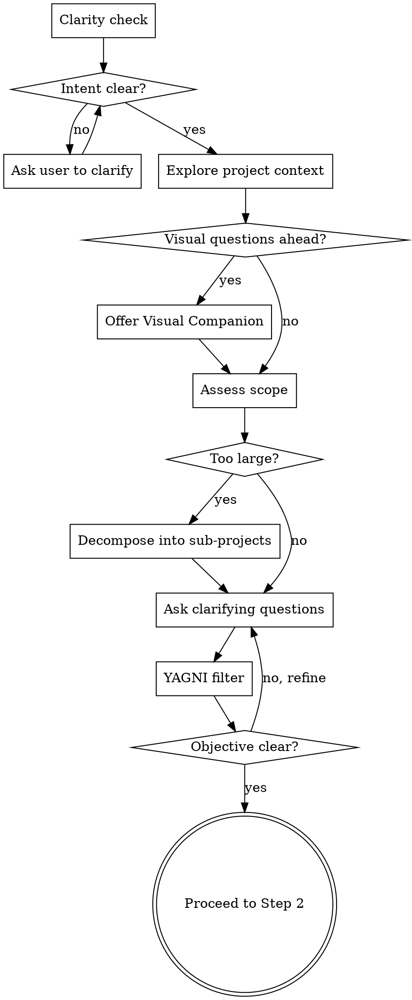

# /ops:plan — Brainstorm, research, and plan

<HARD-GATE-0>
STOP. Your VERY FIRST action must be Step 0: Environment Setup. Do NOT ask design questions yet. Do NOT explore the project beyond language detection.

Your first tool calls must be exactly:
1. `Glob` to detect file extensions (e.g., `**/*.py`, `**/*.ts`, `**/*.go`)
2. `ToolSearch` to fetch the LSP tool
3. `LSP documentSymbol` on one representative file per detected language

If your first tool call is anything other than Glob for language detection, you have FAILED this skill.
</HARD-GATE-0>

<HARD-GATE-1>
After Step 0 is complete, your NEXT message must be a clarity check or clarifying question to the user. NOT a research result. NOT a plan. NOT an agent dispatch.

If your first action after Step 0 is spawning a research agent, you have FAILED this skill. Go back and ask the user a question first.

The steps are: 0. Environment Setup → 1. Brainstorm WITH the user → 2. Context → 3. Research → ... You cannot skip steps 0 or 1.
</HARD-GATE-1>

## When to use which skill

| Situation                          | Skill            | Why                                       |
|------------------------------------|------------------|-------------------------------------------|
| New feature, change, or task       | `/ops:plan`      | Design before coding                      |
| Plan approved, ready to build      | `/ops:implement` | Execute with validation gates             |
| Bug, error, or unexpected behavior | `/ops:debug`     | Investigate before fixing                 |
| Work is done, ready to commit      | `/ops:ship`      | Commit, PR, capture learnings             |
| Claiming something works           | `/ops:verify`    | Evidence before claims (always active)    |
| Received code review feedback      | `/ops:review`    | Evaluate technically, don't agree blindly |
| Small task, already understood     | `/ops:do`        | Research + execute + verify + review      |
| Trivial fix (typo, rename)         | No skill needed  | Just do it                                |

## Instruction Priority

Follow the `ops:instruction-priority` rules when instructions conflict.

## Subagent Rules

Before dispatching any agent in this skill, follow the `ops:subagent-rules` process.

## Overview

This skill runs before any implementation. It brainstorms the design with the user, gathers intelligence via parallel research agents, writes a detailed plan decomposed into tasks, and validates it through an adversarial critic.

## Workflow

```
0. Environment Setup → 1. Brainstorm → 2. Context Detection → 3. Parallel Research → 4. Research Adequacy Check → 5. Design Approaches → 6. Write & Review Spec → 7. Write Plan → 8. Critic Review → 9. User Approval
```

---

## Step 0: Environment Setup (MANDATORY — runs FIRST)

This step runs BEFORE any brainstorming. If LSP needs fixing, the user may need to restart Claude Code — better to catch this before investing time in design.

### 0a. Detect languages

Run the `ops:environment-setup` process (detect languages + LSP diagnostic). Wait for the user's decision before proceeding to Step 1.

---

## Step 1: Brainstorm (MANDATORY — cannot be skipped)

### Anti-Pattern: "This Is Too Simple To Need A Design"

Every project goes through this process. A config change, a single-function utility, a bug fix — all of them. "Simple" projects are where unexamined assumptions cause the most wasted work. The design can be short (a few sentences for truly simple projects), but you MUST present it and get approval.

### Checklist

You MUST complete these steps in order:

- [ ] 1. **Clarity check** — verify you understand the intent before exploring
- [ ] 2. **Explore project context** — check files, docs, recent commits
- [ ] 3. **Offer visual companion** — if topic will involve visual questions (see Visual Companion section below)
- [ ] 4. **Assess scope** — decompose if too large for a single spec
- [ ] 5. **Ask clarifying questions** — one at a time, Socratic style
- [ ] 6. **Challenge scope with YAGNI** — remove unnecessary complexity
- [ ] 7. **Gate** — objective clear, scope agreed

### Process Flow



### The Process

**Clarity check (before anything else):**
Before exploring code or asking detailed questions, verify you understand the user's intent. Ask yourself:
1. **What** is being asked? (Can you restate it in one sentence?)
2. **Why** does the user want this? (What problem does it solve?)
3. **What does success look like?** (How will the user know it works?)

If you can't answer all 3 confidently from the user's request, ask the user to clarify **before** exploring the project. One short question, not three.

> Example: "Before I dive in — I want to make sure I understand. You want [restatement]. The goal is [why]. Is that right, or am I missing something?"

This prevents building the wrong thing. A 10-second check saves hours of wasted planning.

**Exploring the project:**
- Check out the current project state first (files, docs, recent commits)
- Understand existing structure and conventions before asking questions
- This informs your questions — ask smart questions, not generic ones

**Offering the visual companion:**
- If upcoming questions will involve visual content (mockups, layouts, diagrams, architecture), offer the visual companion once for consent. See the Visual Companion section below.
- **This offer MUST be its own message.** Do not combine with clarifying questions.
- If the user declines, proceed with text-only brainstorming.

**Assessing scope:**
- If the request describes multiple independent subsystems, flag this immediately
- Do NOT spend questions refining details of a project that needs to be decomposed first
- Help the user decompose into sub-projects: what are the independent pieces, how do they relate, what order should they be built?
- Each sub-project gets its own spec → plan → implementation cycle

**Asking clarifying questions:**
- **One question at a time** — do NOT overwhelm with multiple questions. This means ONE question per message, not 2-3 grouped together. If you have 5 questions, send 5 separate messages. The user's answer to question 1 may change what question 2 should be.
- **Multiple choice preferred** — easier to answer than open-ended when possible
- Focus on understanding: purpose, constraints, success criteria
- If a topic needs more exploration, break it into multiple questions
- If you catch yourself writing "Question 4:", "Question 5:", "Question 6:" in the same message — STOP. Pick the most important one, send it alone, wait for the answer.

**Challenging scope with YAGNI:**
- Is every part of the request actually needed right now?
- Can a simpler version achieve the same goal?
- Are there features that "might be useful later" but aren't required? Remove them.
- Say explicitly what you're excluding and why. Let the user push back if they disagree.

**Working in existing codebases:**
- Explore the current structure before proposing changes. Follow existing patterns.
- Where existing code has problems that affect the work (e.g., a file that's grown too large, unclear boundaries), include targeted improvements as part of the design.
- Do NOT propose unrelated refactoring. Stay focused on what serves the current goal.

### Gate

**Do NOT proceed to context detection until the objective is clear and the scope is agreed.**

### Visual Companion

A browser-based companion for showing mockups, diagrams, and visual options during brainstorming. Available as a tool — not a mode. Accepting the companion means it's available for questions that benefit from visual treatment; it does NOT mean every question goes through the browser.

**Offering the companion:** When you anticipate that upcoming questions will involve visual content (mockups, layouts, diagrams), offer it once for consent:
> "Some of what we're working on might be easier to explain if I can show it to you in a web browser. I can put together mockups, diagrams, comparisons, and other visuals as we go. This feature is still new and can be token-intensive. Want to try it? (Requires opening a local URL)"

**Per-question decision:** Even after the user accepts, decide FOR EACH QUESTION whether to use the browser or the terminal. The test: **would the user understand this better by seeing it than reading it?**

- **Use the browser** for content that IS visual — mockups, wireframes, layout comparisons, architecture diagrams, side-by-side visual designs
- **Use the terminal** for content that is text — requirements questions, conceptual choices, tradeoff lists, scope decisions

If they agree to the companion, read the detailed guide before proceeding:
`skills/plan/visual-companion.md`

---

## Step 2: Context Detection

**Do NOT skip this step.** It takes seconds and informs every agent downstream. If you jump straight to Step 3 (Research) without doing context detection, you have skipped a required step.

### Explore project structure

Read CLAUDE.md (if it exists), directory structure, and key config files to understand conventions. If no CLAUDE.md exists, infer conventions from the codebase.

---

## Step 3: Parallel Research

Run the `ops:research` process (Steps 2-3: dispatch 3 agents in parallel — researcher-code, researcher-doc, git-historian — and synthesize findings). Scope the research to the task area identified during brainstorming.

---

## Step 4: Research Adequacy Check

Before designing approaches, verify the research produced concrete evidence — not just "we understand".

**You MUST present this table to the user** with the evidence filled in:

| Dimension             | Status   | Evidence                                                       |
|-----------------------|----------|----------------------------------------------------------------|
| **Technical context** | OK / GAP | [Cite `file:line` of similar code or list files read]          |
| **Dependencies**      | OK / GAP | [List of files affected from researcher-code]                  |
| **Risks**             | OK / GAP | [Concrete risks found, or "none found after checking X, Y, Z"] |
| **Documentation**     | OK / GAP | [Sources with versions, e.g., "Context7: express v4.18.2"]     |

This table is not a mental checklist — it must appear in your output so the user can verify the research was adequate.

**If 3-4 dimensions are OK**: Proceed to Step 5.

**If 1-2 dimensions show GAP**:
- Identify the specific gap (e.g., "no similar implementation found — we don't know the pattern to follow")
- Spawn a targeted follow-up agent to fill the gap (researcher-doc or researcher-code, whichever is relevant)
- Do NOT proceed with a half-understood problem

**If 0 dimensions have evidence**: The task is probably too vague. Go back to Step 1 and clarify with the user.

---

## Step 5: Design Approaches

Based on research results, propose **2-3 approaches** to the user.

### For each approach:
- **Name**: Short label (e.g., "Approach A: extend existing module" / "Approach B: new standalone component")
- **How it works**: 2-3 sentences
- **Pros**: Why this approach is good
- **Cons**: What are the tradeoffs
- **Fits conventions**: Does it match existing patterns found by researcher-code?

### Presentation rules:
- **Lead with your recommendation** — present the recommended option first, explain why it's best, then present alternatives
- **Be conversational** — adapt the format to the context. A simple choice can be 3 sentences per option. A complex architectural decision needs more depth.
- **Use the visual companion** if active — for choices with visual implications (layouts, architectures, data flows), show side-by-side comparisons in the browser instead of describing them in text
- **Always present at least one alternative** — even if one approach is clearly superior. The user needs to make an informed decision, not rubber-stamp yours.

### External Dependency Validation (MANDATORY)

Before proceeding to spec writing, identify ALL external dependencies that emerged during the design — components, libraries, tools, charts, images, or services that the project does not already use.

**Distinguish between:**
- **User-requested dependencies** — the user explicitly asked for this ("add rate limiting with Redis") → already validated
- **Agent-chosen dependencies** — you selected this to fulfill the request ("use library X for the UI") → NOT validated, MUST ask

For each agent-chosen dependency, present to the user:

> "To implement [feature], I'd use **[dependency name]** ([source/maintainer]).
> - **Why**: [what it provides]
> - **Alternatives**: [at least 1 alternative + "build it ourselves" if feasible]
> - **Risk**: [maintenance status, maturity, last release]
> Which option do you prefer?"

**Gate**: Do NOT include an external dependency in the spec that the user has not explicitly validated. "Implement X" does NOT mean the user validated every sub-component you chose to implement X. If you chose a dependency, the user must approve it.

If a dependency was already validated conversationally during brainstorming, you do not need to re-ask — but you MUST still present its **risk profile** (maintenance status, last release, community size) before proceeding to spec if it was not covered during the conversation.

This is a gate, not a suggestion. If the spec contains an agent-chosen dependency that was never presented to the user, you have FAILED this skill.

### Gate

**Do NOT proceed to spec writing until the user has chosen an approach AND validated all external dependencies.**

---

## Step 6: Write & Review Spec

After the user has chosen an approach, flesh it out into a full design and persist it.

### 6a. Present the design

Present the design in sections scaled to their complexity:
- A few sentences if straightforward
- Up to 200-300 words if nuanced
- Ask after each section whether it looks right so far
- Cover: architecture, components, data flow, error handling, testing strategy
- Be ready to go back and clarify if something doesn't make sense

**Design for isolation and clarity:**
- Break the system into smaller units that each have one clear purpose
- Communicate through well-defined interfaces
- Can someone understand what a unit does without reading its internals?
- Smaller, well-bounded units are easier to implement, test, and review

### 6b. Write spec document

Once the user approves the design, write it to `docs/specs/YYYY-MM-DD-<topic>-design.md` and commit.

The spec captures the **what** and **why** — the plan (Step 7) captures the **how** (task breakdown).

User preferences for spec location override the default path.

### 6c. Spec review loop

Dispatch the **spec-reviewer** agent to verify the spec is complete and ready for planning.

1. If **Issues Found**: fix the issues, then **re-dispatch the spec-reviewer** following the `ops:redispatch-optimization` process. This re-dispatch is MANDATORY — the reviewer must confirm the fixes are adequate.
2. Repeat until **Approved** (max 3 iterations).
3. If still not approved after 3 iterations, surface the remaining issues to the user for guidance.

### 6d. User reviews spec

After the spec review loop passes, ask the user to review the written spec:

> "Spec written and committed to `<path>`. Please review it and let me know if you want to make any changes before we start writing the implementation plan."

Wait for the user's response. If they request changes, make them and re-run the spec review loop. Only proceed once the user approves.

---

## Step 7: Write Plan

Based on the chosen approach and research results, write a detailed plan with:

1. **Summary**: What we're doing and why (2-3 sentences)
2. **Research findings**: Key insights from the 3 research agents
3. **Approach**: The chosen approach and why
4. **Task breakdown**: See task decomposition rules below
5. **Risks**: What could go wrong

### Task Decomposition (MANDATORY)

The plan MUST be decomposed into discrete, ordered tasks. A plan without tasks is NOT a plan — it's a wish.

Each task MUST have ALL of:
- [ ] **Description**: One clear action (not "set up everything")
- **Files**: Exact paths to create or modify
- **Change**: What specifically changes in each file
- **Validation**: The command to verify this task is done

**Rules**:
- **Sizing guide**: Code-level changes: 2-5 minutes. Setup/integration tasks (test framework, CI config, complex resources): up to 30 minutes. No fixed upper limit for complex features — size by coherence, not by clock.
- Each task MUST be independently verifiable via its validation command.
- Tasks MUST be ordered by dependency (prerequisites before dependents, config before consumers, schemas before data).
- A task that touches more than 3 files is probably too big. Consider splitting it.

### CLAUDE.md-Driven Tasks (when CLAUDE.md exists)

Read `CLAUDE.md` (and `.claude/CLAUDE.md` if it exists). If neither exists, skip this section — there are no project-specific rules to generate tasks from.

If CLAUDE.md exists, scan the project rules for any action that is required for the type of change being made. If a rule applies, **generate an explicit task for it in the plan**.

CLAUDE.md rules are not just conventions to follow — they are **task generators**. Any rule that says "when doing X, also do Y" means Y must be a task in the plan, not a mental note.

How to apply:
1. Read all CLAUDE.md rules
2. For each rule, ask: "does this apply to the current change?"
3. If yes, add a dedicated task with files, change description, and validation command
4. If unsure whether a rule applies, include it — the critic or the user can remove it

**Do NOT treat CLAUDE.md rules as "nice to have".** If a rule applies to this change, it MUST have a corresponding task in the plan.

**Gate**: Do NOT proceed to critic review if the plan has no task breakdown or if any task is missing files/change/validation. If CLAUDE.md exists and applicable rules have no corresponding tasks, do not proceed either.

**Present the plan in sections** short enough to read and digest — not a wall of text. Let the user absorb each section before the next.

---

## Step 8: Critic Review

Spawn the **critic** agent to review the plan.

The critic:
1. **Pre-engagement**: Predicts 3 potential problems BEFORE reading the plan details (prevents confirmation bias)
2. **Reviews against 4 lenses**: Missing steps, Contradictions, Security vulnerabilities, CLAUDE.md compliance
3. **Multi-perspective review**: Executor, Stakeholder, Skeptic viewpoints
4. **Gap analysis**: What's missing that nobody asked about?
5. **Self-Audit + Realist Check**: Low-confidence findings become Open Questions, severity ratings are pressure-tested
6. **Escalation**: If CRITICAL found or 3+ IMPORTANT → adversarial mode (expand scope, challenge every decision)
7. **Verdict**: APPROVE or REJECT with confidence levels and perspective attribution

**If REJECT**: Revise the plan addressing the critic's concerns, then **re-dispatch the critic** following the `ops:redispatch-optimization` process. This re-dispatch is MANDATORY — do NOT skip it. Maximum 3 iterations. If still rejected after 3 rounds, present both the plan and the critic's concerns to the user for decision.

If you fix the critic's concerns but do not re-dispatch the critic, you have FAILED this skill. The whole point of the critic is adversarial validation — bypassing the re-check defeats the purpose.

**If APPROVE**: Proceed to Step 9.

---

## Step 9: User Approval

Present the validated plan to the user with an explicit question:

> "The plan has been validated by the critic. Do you want to launch it as-is, modify something, or review a specific point?"

Do NOT proceed to `/ops:implement` until the user explicitly approves. The user invoking `/ops:implement` counts as approval, but you should still ask before they need to invoke it.

The plan remains in conversation context for `/ops:implement` to consume.
